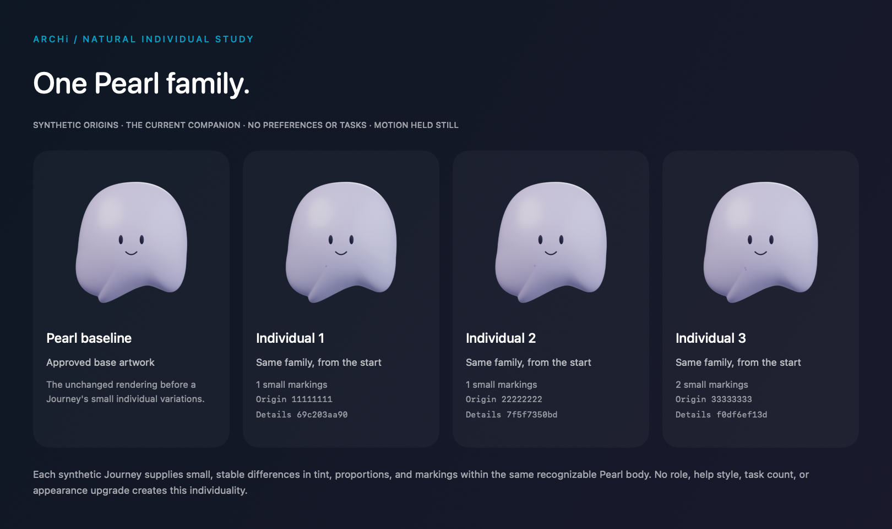

# ARCHi · desktop companion Alpha

ARCHi is a local-first personal companion: a movable desktop presence, useful text assistance, a place to learn what you explicitly teach, and a shared Habitat with QiMon practice battles. The same individual and selected appearance continue between work and play.

**Status: Alpha source candidate for `cr8ph8/ARCHi`, planned tag `v0.7.0-alpha.1`.** This is an early macOS application for supervised local testing. Candidate verification, repository publication, the tag and any downloadable app assets must be confirmed separately; this document is not a release receipt. The current build produces a locally signed development app, not a notarized installer.



## What is included

- **Native desktop app:** SwiftUI/AppKit workspace, floating companion, local placement, activity cues, keyboard controls and reduced-motion options.
- **Personal assistance:** local Qwen through Ollama by default; independent optional Codex and deliberate Compare routes. Send captures your current instructions and confirmed help preferences. Stop retires the owned request.
- **Teaching:** explicitly kept, inspectable and withdrawable lessons. Matching lessons are supplied only to local Qwen; the current matcher uses topic phrases, source scope and expiry.
- **Work together:** share a UTF-8 text copy, select an exact passage, ask for an explanation or revision, inspect Before/After, Apply, Undo once and export a separate draft. The imported original is preserved.
- **Habitat and play:** care, exploration, the Relay activity, local practice battles and versioned Journey history run inside the native app's retained WebKit host. You do not need to open a browser or start a separate development server.
- **Individual appearance:** the familiar Companion/Pearl and supported Lumen study receive small, repeatable variations from the existing Journey origin. Role choices, work counts and battles are not appearance quotas. Larger form changes are explicit choices; they do not rewrite life history or prove learned development.
- **Optional expression:** a local Reactor preview and a separately reviewed, bounded API-trial path. Local artwork remains the fallback. Blender and Unity are authoring/validation tools, not required application runtimes.

## QiMon practice battles

The included TypeScript battle engine resolves simultaneous commands deterministically. Teams contain one to three participants and share fixed starting resources. The available actions are Pulse, Guard, Signature, Swap and Surrender; role-specific abilities belong to the battle rules. A local practice partner chooses from public state before the player seals a command. Same-device two-player play is also retained.

Native controls submit legal, revision-bound actions to that same engine. A completed eligible partner encounter can be explicitly kept after replay validation and deduplication. Temporary encounters and larger appearance changes do not create collectible ownership, new permissions or a trained assistant capability.

The reusable source is in [the battle engine](src/battle-engine.ts), [practice history](src/model.ts), and [the native host bridge](src/desktop-host.ts). There is no separate Unity battle runtime in this Alpha.

## Build and open locally

Initial qualification focuses on an Apple Silicon Mac. Building requires:

- macOS 14 or later and a Swift 6 toolchain with the macOS SDK;
- Node.js 24 or later and npm for the bundled TypeScript assets;
- the checked-in source and lockfile.

From the repository root:

```sh
npm ci
./script/build_and_run.sh --verify --review
```

The script typechecks and bundles Habitat, builds Swift, runs the default native test suite, signs the development bundle and requests launch. It prints the generated app's absolute path. It refuses to replace a running selected profile: export any working draft, save wanted choices and quit that app normally, then rerun. Keep it closed during compilation.

`--review` selects **ARCHi Development Review**, with separate native saves and Habitat storage from the ordinary Preview. Omitting `--review` selects the ordinary **ARCHi Desktop Preview** instead. The bundle is staged in the operating system's temporary directory and may need rebuilding if that directory is cleared. Do not rebuild merely to reopen an existing candidate.

The separate shared-engine test command is:

```sh
npm test
```

These commands describe available verification paths. Their presence does not imply that this checkout, your Mac or every opt-in integration test has passed.

## Connect assistance

Start the installed local Ollama service and use **Connections → Qwen → Connect**. The supported model names are `qwen3.5:9b` and `qwen3:8b`; a selected model must already be installed. ARCHi does not download models or fall back to a hosted provider automatically. If neither is installed, local character and play features remain available.

Connect checks availability without submitting the draft. Send shares the current question, the full deliberately shared document copy and its selected passage with the selected route. A short selection does not remove the rest of that shared copy from the request. Oversized input is rejected instead of silently truncated.

Codex is optional and uses an existing signed-in Codex/ChatGPT runtime in the installation layout expected by the adapter. Other installation layouts may need an adapter change. Compare requires both connections and keeps the replies separate; neither model teaches or trains the other automatically. Kept local lessons and temporary local excerpts are not forwarded to Codex.

Reactor's local preview, public readiness check and paid live trial are separate actions. An account key and explicit review are required for a live trial. Live generated likeness and provider shutdown remain qualification work. Its optional Python/SDK setup is not a portable end-user package yet; assistance and play do not depend on it.

## Save before leaving

| Data | Current retention behavior |
|---|---|
| Appearance and reply rhythm | Save choices explicitly; saved preferences load at startup. |
| Kept lessons | Explicit Keep/revise/withdraw writes the existing settings file; saved lessons load at startup. |
| Evolution and later appearance choices | **Save evolution** and **Load saved** are both explicit. A new launch does not automatically load Evolution. Valid legacy v1–v3 saves remain supported by v4. |
| Journey | Existing local history storage and explicit outcome Keep remain authoritative. Continuity can export and review a separate Journey copy. |
| Working document and Undo | Session-only. Export a separate draft to retain edits across quit; one-step Undo is not saved. |
| Replies, drafts and temporary context | Session-only; no durable conversation archive is provided by this flow. |

A Journey export is not a complete companion backup: native preferences, lessons and Evolution are separate. Preserve the relevant files and exports before restore experiments. The app warns before discarding an unexported working copy through normal Quit, Change document or Stop sharing; that does not replace backup or protect against process termination or a machine failure.

## Alpha limits and recovery

- Earlier development checks exposed an initial Habitat handoff timeout. Readiness ordering and bounded latest-request retry were repaired and passed focused native checks; broader startup reliability remains qualification work. Use the native Retry control. A reserved-port error usually means another copy of the same profile is open; close that copy normally before retrying.
- Offscreen PNG bytes can differ slightly between render orders. The checked images retain exact dimensions and alpha and pass a bounded pixel comparison; this Alpha does not promise deterministic image bytes.
- Local model latency, sleep/wake, multiple displays, full VoiceOver traversal, storage failure, complete restore and installation on another Mac are not fully qualified.
- A file can fit the document viewer's import limit and still exceed the smaller model-request budget. Use a shorter separate text document when needed.
- If Qwen is unavailable, start Ollama or select an installed supported model, then Connect again. After Stop, timeout or source invalidation, reconnect and select the current passage before resending.
- Recover a hidden companion from the menu-bar sparkles icon or **Window → Show companion**. Closing the workspace leaves the app running; Quit ends it.
- Preserve unreadable saves and report the error. Do not use Delete, Forget or Replace merely to dismiss a recovery problem.

Mobile, camera/AR, native voice, external-application editing, model training, a full ARC solver, persistent collectible trading and a complete 3D character runtime are later work. Structured output validation checks the accepted contract; it is not a guarantee of factual accuracy or human benefit.

## Hampton Designed, identity and future specialties

**Hampton Designed is an approved product direction; its verification service and creator editions are future work.** The creator seal is intended to identify an explicitly endorsed design, distinctive appearance and versioned signature abilities. Those abilities must stay within the same gameplay power budget, with meaningful costs, tradeoffs and counterplay. The seal, rarity or payment must never provide an automatic win.

The current Journey ID and origin digest support local continuity and reproducible presentation. A UID does not authenticate its own creator, prove exclusive ownership, enforce edition scarcity, assign a price or establish a valid sale. Future issuer provenance, edition records and ownership records require separate verification. Private assistant memories and shared work are excluded from transferable character records.

The [Hampton Designed policy](docs/HAMPTON_DESIGNED.md) describes this direction and its acceptance criteria. MIT permission to use or modify the code is separate from official creator endorsement. No marketplace, NFT issuance, signed creator registry or ownership authentication is implemented in this Alpha.

## Feedback and license

For a reproducible issue, include the candidate's commit/build identifier, macOS version, route/model when relevant, expected behavior and minimal nonprivate reproduction steps. Report pass, fail or not tried rather than assuming an untested path works. Exclude document contents, private lessons, credentials and account details unless they are deliberately replaced by a synthetic fixture.

**License: [MIT](LICENSE)** for the included project-authored source, documentation and runtime artwork. See [asset attribution](ASSET_ATTRIBUTION.md) and [third-party notices](THIRD_PARTY_NOTICES.md). The Hampton Designed policy adds no restrictions to MIT permissions and does not make a fork an authenticated creator edition. External models, SDKs and tools retain their own terms.
